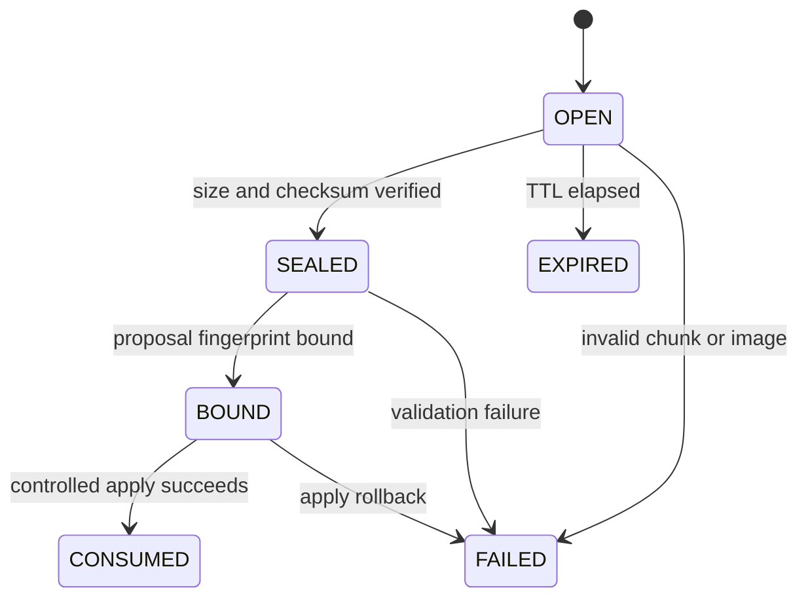

# NHK V3 Connected Media + Video Transport Design

> **NON-NORMATIVE DESIGN.** If this document conflicts with
> `docs/constitution/NHK_V3_CONSTITUTION.md`, the Constitution controls.

## Goal

Make one user request from a connected ChatGPT/Codex session able to complete
the governed image and Video workflows without using a generic WordPress
writer, without creating a second semantic persistence path, and without
claiming success before canonical read-back succeeds.

The implementation must preserve the existing raw multipart Media path for
clients that can send files, add a connector-safe staged upload fallback for
JSON-only WordPress Abilities clients, and retain the existing Video plus
Proposal lifecycle Ability bridge.

## Current-state findings

The current implementation already has the important domain pieces:

- `nhk.media.ingest` exists in `McpToolCatalog` and accepts a direct multipart
  file on the custom `/nhk/v1/mcp` transport.
- `McpApi` keeps the JSON-RPC envelope and WordPress multipart file parameters
  separate and passes both into `McpTransport`.
- `nhk.video.ingest` and the Proposal lifecycle are projected to WordPress
  Abilities and delegate back to the canonical MCP transport.
- `MediaIngestGateway`, `MediaService`, `WordPressMediaAttachmentBridge` and the
  Media repositories already provide most of the canonical Media/asset/
  attachment mapping boundary.

The blocking defects are transport and atomicity defects, not missing Media or
Video domain models:

1. `nhk.media.ingest` is intentionally excluded from
   `McpAbilityRegistration`; a JSON-only connected app therefore cannot send an
   attached file to the governed Media tool.
2. The direct file adapter creates a WordPress attachment before canonical
   adoption completes. Its `finally` block removes only some pre-attachment
   files; an adoption, mapping, source persistence or final read-back failure
   can leave an attachment, a public derivative, a source file, mapping state,
   or semantic rows behind.
3. The source-original file is currently stored below the WordPress uploads
   directory and only labelled `PRIVATE` in semantic metadata. Storage location
   and delivery policy do not prove that those bytes are actually protected.
4. The file branch of `nhk.media.ingest` performs direct adoption, while the
   metadata branch creates a Proposal. That split must be removed so a semantic
   Media identity is never created outside Proposal → Approval → Eligibility →
   Controlled Apply.
5. Exact connected-app capability is runtime state. Repository catalog and
   Ability registration tests cannot substitute for fresh discovery and
   authenticated read-back.

These findings are a current `CONSTITUTION_CONFLICT` in the existing file
adapter. The implementation resolves the conflict; it must not weaken the
Constitution or reclassify the current behavior as compliant.

## Considered approaches

### A. Raw multipart plus governed staged-upload fallback — selected

Keep raw multipart as the efficient path. Add connector-facing upload-session
Abilities that stage bytes only, then let `nhk-v3/media-ingest` create the same
governed Media Proposal from a sealed session. Both paths converge before any
semantic or WordPress attachment write.

This is the selected approach because it supports both capable raw clients and
JSON-only connected apps, preserves one canonical writer, permits bounded
chunking and checksum verification, and keeps an attached file out of the
Proposal payload.

### B. Generic WordPress upload followed by adoption — rejected

This creates a WordPress attachment before the governed operation owns the
request, exposes source bytes according to generic upload policy, and makes
cleanup and idempotency dependent on hooks. It also violates the explicit task
constraint against generic WordPress writers.

### C. One large base64 field on the semantic Media tool — rejected

This couples semantic proposal input to binary transport, adds approximately
one-third transfer overhead, amplifies memory use, makes retry behavior coarse,
and conflicts with the current Media MCP contract. The fallback may use bounded
base64 chunks as a transport encoding inside an upload session, but the sealed
binary is never embedded in the semantic Proposal.

### D. A second REST endpoint that writes Media directly — rejected

An alternate writer would duplicate validation, permissions, persistence,
idempotency and rollback behavior. A REST endpoint may transport staged bytes,
but it cannot create Media, MediaAsset, MediaUsage, attachment mapping or Graph
state.

## Selected architecture

### 1. Transport-neutral staging boundary

Introduce `MediaUploadSessionService` with a repository and a protected staging
store. A session is infrastructure/workflow state, never a Media identity,
Authority entity, Evidence object or Graph endpoint.

The session state machine is:

Required session fields are: UUID, hashed bearer token, authenticated principal,
original filename, declared and observed byte size, ordered offset, source
SHA-256, detected MIME, dimensions, state, expiry, proposal ID/fingerprint when
bound, consumption receipt, and timestamps. Raw token material is returned once
and is never stored.

Migration 015 creates an upload-session control table. `UP` is allowed only on
`nhk_v3` and `nhk_v3_test`; `DOWN` is guarded to exact `nhk_v3_test` plus force,
matching existing migration law. Staged bytes live outside the public web root
under an explicitly configured protected root. Missing or unsafe configuration
fails closed.

### 2. Connector-facing abilities

Add three capability-gated, non-semantic transport tools:

- `nhk.media.upload.start` / `nhk-v3/media-upload-start` creates an `OPEN`
  session and returns its ID, one-time token, chunk bound and expiry.
- `nhk.media.upload.chunk` / `nhk-v3/media-upload-chunk` accepts session ID,
  token, exact offset and a bounded base64 chunk. It appends only when offset,
  ownership, expiry and cumulative size are valid.
- `nhk.media.upload.seal` / `nhk-v3/media-upload-seal` verifies final byte count,
  SHA-256, actual image MIME, readable structure and dimensions, then returns a
  reader-safe `SEALED` receipt.

The chunk action is a transport fallback only. It cannot create an attachment,
Media, asset, usage, proposal or relationship. A duplicate chunk at the same
offset and checksum is idempotent; overlapping or divergent replay fails
closed. The server limits decoded chunk size, total image size, chunk count,
session age and concurrent open sessions per principal.

Register `nhk-v3/media-ingest` as the connector-facing governed Ability. Its
session-backed form accepts a sealed `upload_session_id` plus the semantic filename,
name, readiness, provenance and optional governed usages. It delegates to the
same `McpTransport` handler and creates a Media ingest Proposal. It does not
apply the Proposal.

The existing raw multipart `nhk.media.ingest` path first imports its file into
the same staging boundary and then invokes the same proposal factory. Raw and
Ability clients therefore differ only before `SEALED`; there is no binary fast
path that bypasses Governance.

### 3. Immutable proposal binding

The Media proposal payload contains only the sealed session UUID and immutable
observations required for binding: checksum, byte size, detected MIME,
dimensions and normalized filename intent. The content fingerprint covers those
fields, usage/context input and policy version. Eligibility rejects an expired,
unsealed, principal-mismatched, already-bound-to-another-proposal or changed
session.

Approval never authorizes different bytes. Replacing a staged file, changing
its checksum, altering usage intent or changing the Media policy version
invalidates eligibility and requires a new proposal or approval binding.

### 4. One canonical controlled-apply service

Introduce `GovernedMediaBinaryIngestService`, invoked only by
`AuthorityProposalExecutor` for a Media ingest proposal containing a sealed
session. It composes the existing Media service and WordPress bridge rather than
reimplementing their rules.

Apply performs these phases:

1. Revalidate session binding, source checksum, actual image structure,
   dimensions, MIME and protected-root containment.
2. Normalize orientation and build the bounded WebP public derivative in a
   private work area. Do not upscale or crop; enforce the existing 2048-pixel
   long-edge policy and quality bounds.
3. Start the semantic/database transaction and create-or-resolve exactly one
   Media through `MediaIngestGateway`.
4. Register the protected source-original as a `PRIVATE` original MediaAsset
   and the optimized output as a derivative under the same Media.
5. Project only the optimized derivative to WordPress, persist the one-to-one
   mapping and controlled usage metadata, and never expose the source-original
   as an attachment URL.
6. Read back the Media, both asset records, source checksum/path containment,
   derivative checksum/dimensions/MIME, attachment mapping and public
   representation.
7. Commit the database transaction, atomically mark the session `CONSUMED`, and
   return one receipt containing proposal ID, Media UUID, asset IDs, attachment
   ID, canonical public URL, checksums and diagnostics.

The service must reuse the existing role/detail/SEO registries. Upload title,
filename, alt text, OCR and visual content do not create `about`, `depicts`,
Knowledge, Source, Evidence or any other semantic relation.

### 5. Failure cleanup and recovery

Filesystem and WordPress operations are not fully transactional, so apply uses
an explicit artifact journal. Every created workfile, protected source,
derivative, attachment and mapping is recorded before moving to the next phase.

On failure:

- roll back the semantic/database transaction;
- delete only artifacts created by the current attempt, in reverse order;
- verify their absence;
- retain the failed Proposal attempt and bounded reason code;
- mark the session `FAILED` only after cleanup outcome is recorded;
- return non-success if cleanup or its verification is uncertain.

Pre-existing idempotently reused Media/assets/attachments are never deleted by
compensation. A scheduled cleanup removes expired unbound staging sessions only;
it cannot delete `BOUND` or `CONSUMED` source assets.

### 6. Idempotency and duplicate handling

The same session, proposal and idempotency key must return the prior result
after a successful apply. A retry after an uncertain response first reads the
Proposal, session, Media, assets and mapping; it does not blindly repeat a
WordPress insert.

Source checksum is a duplicate candidate, not semantic identity. Reuse requires
the existing canonical Media resolution policy and exact proposal binding.
Different semantic context with identical bytes cannot auto-merge Media.

### 7. Video workflow

Video remains an external canonical reference; no local MP4 upload path is
added. The existing `nhk-v3/video-ingest` Ability creates a Proposal and the six
Proposal transition/read actions remain the only connector write workflow.

The implementation adds parity assertions rather than a second Video writer:

- all seven required Video/Governance actions map one-to-one to catalog tools;
- their input schemas and permission capabilities match the raw MCP catalog;
- URL normalization deduplicates supported URL forms by external video ID;
- unsupported platform, malformed or conflicting ID/URL fails closed;
- publish/apply remains blocked without a valid explicit semantic attachment
  and evidence reference;
- source metadata and user/editorial input retain separate provenance;
- apply and `video-get` read-back agree on canonical UUID and public-safe data.

### 8. Capability and runtime truth

`McpToolCatalog` remains the operation source. Every catalog tool must map to an
Ability or have a current explicit exclusion. After this change, Media upload
session tools and the sealed-session Media ingest tool have Ability mappings;
the raw multipart form remains a custom transport feature, not a separate
semantic operation.

Repository tests prove registration and delegation only. Acceptance also
requires fresh authenticated discovery from the actual connected app and these
read-only probes before any real write:

1. `video-get` returns a structured validation or reader-safe response.
2. The seven required Video/Governance actions are present.
3. Media upload start/chunk/seal and governed Media ingest are present.
4. Permissions fail with structured capability errors for an under-privileged
   principal.

Runtime capability reporting must distinguish `CALLABLE`, `FORBIDDEN` and
`ABSENT`; it must not collapse them into one unavailable state.

## Security limits

- Authenticate every session action and bind it to the WordPress principal.
- Require a random high-entropy token; persist only its hash and compare in
  constant time.
- Reject data URLs, remote fetch URLs, path input, nested multipart ambiguity,
  unsupported MIME, polyglot/unreadable images and declared/observed mismatch.
- Enforce configured total size, decoded chunk size, chunk count, open-session
  count and TTL before writing more bytes.
- Use exclusive creation, non-following file operations where available,
  canonical-path containment and restrictive filesystem permissions.
- Never log file bytes, bearer tokens, credentials or source-original URLs.
- Keep public delivery limited to validated derivative assets whose parent
  Media is active/ready and whose policy permits publication.

## Test strategy

Implementation follows TDD. Focused unit tests cover schemas, registration,
state transitions, offsets, replay, token ownership, expiry, size bounds,
checksum/MIME/dimension validation, proposal fingerprint binding and Video
catalog parity.

Guarded integration tests run only against exact `nhk_v3_test` and cover:

- raw multipart and chunked-session inputs converging on one proposal path;
- successful approval/apply producing one Media, one private original, one
  public derivative and one attachment mapping;
- source-original absence from public attachment URLs;
- corrupt, fake, truncated, checksum-mismatched and path-escape inputs leaving
  zero orphan rows/files/attachments;
- injected failure at each apply phase followed by verified compensation;
- retry/read-back without duplicate Media, assets or attachments;
- Video create → submit → approve → eligibility → apply → get;
- permission failures and catalog/Ability parity.

Required checkpoint gates are focused tests, full Unit suite, guarded
integration when the exact test runtime is available, PHP lint, Composer
validation, migration status/read-back, `git diff --check`, and secret scan.
Missing PHP, Composer, WordPress, database, deployment configuration or live
connector access is reported as `ENVIRONMENT_BLOCKED`; it is never converted to
a pass.

## Documentation changes during implementation

Update the current Media and MCP contracts to describe the staged connector
transport, while preserving the ban on embedding a whole binary/data URL in a
semantic proposal. Update `CURRENT_DOCUMENTATION_STATUS_INDEX.md`,
`V3_EXECUTION_STATE.md`, the Media/Video implementation evidence and the
relevant parity row. Do not rewrite historical evidence as though it had always
described the new behavior.

## Out of scope

- No generic WordPress media writer or upload-from-URL shortcut.
- No image recognition, OCR promotion or inferred semantic relation.
- No local Video binary download.
- No article creation/publication, featured-image assignment or content edit.
- No live data upload, Proposal creation, approval, apply, deployment or final
  production cutover as part of the code checkpoint.
- No mutation of V2, staging or production data.

## Acceptance result

The feature is complete only when code, tests and current contracts demonstrate
one governed semantic path; the actual connected app freshly exposes the Media
session/ingest actions and all seven Video/Governance actions; a guarded test
upload survives canonical read-back; failure injection leaves no orphan; and
Video read-back proves the applied identity. Git push alone is not runtime
acceptance.
