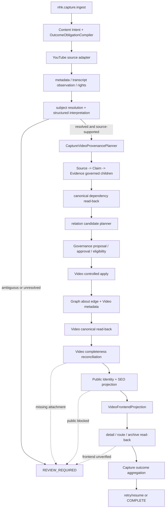

# NHK V3 — Deep Video Semantic Architecture Review & Cross-Domain Law Alignment

**Phase:** Research + Design only
**Date:** 2026-10-09
**Checkout reviewed:** `e7b94b6f1b0c71a0054b6d03176cc8e9f4a8fd7a`
**Runtime mutation:** none
**Scope:** Video Capture, Source/Knowledge/Evidence, Graph, Governance, editorial, SEO, Public Identity, frontend, recovery and MCP exposure.

## 1. Executive diagnosis

The reported state is not evidence that Source, Knowledge, Evidence and Video
completion imply a valid Video semantic relation. NHK V3 deliberately keeps at
least eight gates independent:

1. source identity/authenticity;
2. semantic subject resolution;
3. factual Claim/Evidence validity;
4. Graph relation validity;
5. canonical Video owner read-back;
6. editorial quality;
7. public eligibility/Public Identity;
8. frontend read-back.

For `19gd6J_A5To`, the checkout contains a plausible failure seam: a resolved
subject is not, by itself, a relation candidate. `VideoIntakeService` starts
from intended relations, filters them to a resolved subject, and only appends
research matches that already carry Evidence refs (`VideoIntakeService.php:44-66`).
The Capture-specific planner can later construct the Source/Claim/Evidence
dependency and relation descriptor (`CaptureVideoProvenancePlanner.php:205-228`),
but only when its handoff conditions pass. Therefore the exact live candidate
set, Evidence state and Graph state remain **UNVERIFIED** without read-only
target-runtime read-back.

The strongest checkout-level diagnosis is a boundary mismatch, not a proven
single defect:

- canonical Video owner persistence is intentionally allowed before optional
  semantic attachment/enrichment (`AuthorityProposalExecutor.php:301-306`);
- publication/completeness still requires an Evidence-backed `about` attachment
  (`VideoCompletenessPolicy.php:41-71`, `CaptureVideoPublicationVerifier.php:86-125`);
- canonical reconciliation reconstructs attachments only from a matching active
  Graph edge plus stored metadata attachment plus valid canonical Evidence
  (`VideoCompletenessReconciliationService.php:55-117`);
- the current generic outcome compiler makes `relations` depend on incoming
  signals, while Video-specific publication verification independently requires
  the attachment (`OutcomeObligationCompiler.php:68-87`).

Thus `NO_SEMANTIC_ATTACHMENT` legitimately blocks Video semantic/public
completion and Graph completion. It does not necessarily block creation of the
canonical Video owner. It is a deliberate publication/completeness policy,
unless a target-runtime read-back proves that a valid candidate and valid
Evidence were available but were lost or not reused.

The narrowest safe recommendation is to preserve the existing constitutional
law for all public-capable/publish requests, improve obligation compilation and
diagnostics so the relation obligation is explicit, and introduce no new Graph
predicate, owner or storage boundary. A future canonical-only Video intent may
be allowed only as an explicitly non-public/non-frontend outcome; this requires
an approved policy amendment if it changes the current Video Law, and must not
silently downgrade a requested public Video.

## 2. Authority, evidence classes and runtime boundary

### 2.1 Source-of-truth order

The review used this order:

1. `docs/constitution/NHK_V3_CONSTITUTION.md`;
2. active domain contracts and MCP contracts;
3. executable registries/services and their tests;
4. fresh runtime read-back;
5. `V3_EXECUTION_STATE.md` and the status index;
6. dated plans/audits as historical evidence.

The Constitution remains the only normative Constitution. The status index is a
router, not a second law. A historical index paragraph still says that Video is
not inside Capture (`CURRENT_DOCUMENTATION_STATUS_INDEX.md:397-406`), while its
later current boundary says the registered Video adapter enters Capture
(`CURRENT_DOCUMENTATION_STATUS_INDEX.md:352-368, 526-527`). The later current
entry and executable checkout are used; the contradiction is recorded as a
documentation drift, not resolved by weakening the Constitution.

### 2.2 Runtime versus checkout

The local checkout is exactly the user-supplied source revision at `HEAD`, but
the worktree is dirty with pre-existing user changes. No dirty file was changed.
The execution state explicitly says the authorized TEST runtime tuple is not
available: staging identity, database `erourxcg_nhkv3`, and
`https://demo.1945.vn` are not present in the local runtime configuration
(`V3_EXECUTION_STATE.md:58-63`). Consequently:

- no sample Capture, Video, Source, Claim, Evidence, Graph, Public Identity or
  frontend record was read from the target runtime in this review;
- no deployed documentation manifest or deployed build identity was freshly
  compared;
- the four sample statuses are treated as user-supplied observations, not
  independently verified live facts;
- no data mutation, replay, migration, deployment, push, pull or connector
  invocation was performed.

The exact missing evidence for case 1 is a read-only packet containing the
Capture outcome plan/fingerprint, source/claim/evidence canonical read-backs,
Video metadata, candidate/attachment packet, Graph edge and relation context,
Public Identity, projection, route/archive/home read-backs, and phase receipts.

## 3. Evidence ledger

| Finding | Exact checkout evidence | Classification of evidence |
|---|---|---|
| Video source identity is platform plus external ID; external URL is not the canonical first-party route | `docs/architecture/VIDEO_YOUTUBE_SOURCE_CONTRACT.md`; `docs/constitution/NHK_V3_CONSTITUTION.md` §13.2 and 2026-09-07 amendment | Constitutional/contractual requirement |
| One Capture is the normal new-content entry point, with a registered Video adapter | `CURRENT_DOCUMENTATION_STATUS_INDEX.md:352-368, 526-527`; `docs/mcp/MCP_V3_VIDEO_WORKFLOW.md` | Active contract/status + code-aligned behavior |
| `resolvedSubject` is not automatically an Evidence-backed relation | `VideoIntakeService.php:44-66`; only research matches with non-empty Evidence refs are appended at `:55-63` | Runtime code behavior |
| Capture Video provenance planner is planning-only and cannot create Evidence itself | `CaptureVideoProvenancePlanner.php:13-18`; dependency payloads and relation descriptor at `:205-228` | Runtime code behavior |
| Exact subject handoff can fail closed when source support is missing | `CaptureVideoProvenancePlanner.php:126-155` | Runtime code behavior; tested by Capture/Video suites |
| Source→Claim→Evidence is read back before final Video proposal | `GovernedCaptureContinuationService.php:920-973` | Runtime code behavior |
| Final relation candidate is created only after Evidence read-back | `GovernedCaptureContinuationService.php:973-998` | Runtime code behavior |
| Canonical Video may exist before relation attachment | `AuthorityProposalExecutor.php:301-306` | Runtime code behavior and deliberate policy comment |
| Video apply validates Evidence refs before Graph changes | `AuthorityProposalExecutor.php:317-329` | Runtime code behavior |
| Current executor creates/reuses Graph edge and then Video completeness is reconciled | `AuthorityProposalExecutor.php:330-389` | Runtime code behavior; relation-context responsibility needs explicit acceptance test |
| Completeness requires a non-empty semantic attachment and treats transcript absence only as a warning | `VideoCompletenessPolicy.php:41-71` | Runtime code behavior |
| Reconciliation requires matching stored attachment, active `about` edge and valid Evidence | `VideoCompletenessReconciliationService.php:55-117` | Runtime code behavior; strongest stale-read-model seam |
| Publication verifier requires `about`, target UUID, Evidence refs, Evidence read-back and optional Graph read-back | `CaptureVideoPublicationVerifier.php:86-125` | Runtime code behavior |
| Public projection requires Public Identity, source, editorial, Hub, provenance and semantic attachment | `VideoUrlPolicy.php:10-45`; `VideoFrontendProjection.php:19-54` | Runtime code behavior |
| Frontend reconciliation is read-only and verifies owner-bound detail, route and archive | `VideoFrontendReconciliationService.php:11-18, 58-121` | Runtime code behavior |
| Homepage is a separate surface from detail/archive | `VideoFrontendReconciliationService.php:96-114`; `HomeSemanticQuery.php:113-145` | Runtime code behavior/contract |
| A Video owner with canonical read-back can be retried without creating a second owner | `CaptureCurrentOutcomeReducer.php:401-424`; `GovernedCaptureContinuationService.php:1259-1293` | Runtime code behavior |
| Outcome `relations` is signal-driven, not intrinsically Video-typed | `OutcomeObligationCompiler.php:68-87` | Runtime code behavior; possible contract alignment gap |
| Existing tests intentionally preserve `NO_SEMANTIC_ATTACHMENT` for empty input | `VideoGovernanceGenericityTest.php:204-218, 274-283` | Tested behavior |

## 4. Current-state lifecycle



Important sequencing law: Source/Knowledge/Evidence owner `COMPLETE` is an
intermediate dependency state. It is not a proof that the final Video proposal
contains the exact Evidence ref, that the Graph edge exists, that the Video
metadata attachment survived apply, or that public/frontend obligations passed.

## 5. Four truth dimensions and four outcome gates

| Dimension | Truth owner | What proves it | What must not prove it | Current independence |
|---|---|---|---|---|
| Source identity/authenticity | Source + YouTube adapter | canonical platform/ID, availability, embeddability, rights/read-back | URL text, title alone | Independent |
| Semantic subject resolution | Authority resolver/Capture packet | exact UUID/type/revision, bounded scope, conflict-free handoff | lexical match, user hint alone | Independent |
| Factual Claim/Evidence | Knowledge/Source/Evidence | active canonical Claim, Source and Evidence closure | transcript, generated prose, source title alone | Independent |
| Graph relation validity | Graph + governed relation context | registered `about`, exact endpoints, revisions, provenance, Evidence refs, read-back | reachability or stored attachment alone | Independent |
| Canonical Video completion | Video owner/Governance | owner read-back, CAS/idempotency, valid external identity/editorial/embed | Evidence owner completion | Deliberately separate |
| Editorial quality | Video editorial policy | title/summary/body and quality decision | raw source title copied as proof | Separate |
| Public eligibility | Video URL/SEO/Public Identity | active source, rights, Hub/provenance/attachment, Public Identity and projection | canonical owner success | Separate |
| Frontend verification | frontend reconciliation | exact owner-bound detail/route/archive read-back | projection object only | Separate; homepage conditional |

The current system couples these dimensions only at the final publication
decision, where all required gates must pass. It does not correctly couple
Evidence-owner completion to Graph attachment; that separation is necessary.
The main alignment risk is that a generic outcome plan can label relation
obligation `OPTIONAL` when caller signals omit `relations_required`, while
Video-specific publication code still blocks on the relation. This is a
diagnostic/obligation alignment gap, not permission to publish without the
relation.

## 6. Case analysis

### 6.1 `19gd6J_A5To` — exact Odo 36 subject, `NO_SEMANTIC_ATTACHMENT`

**Observed input supplied by the user:** exact Model Odo 36, Source/Knowledge/
Evidence/Video owners `COMPLETE`, Video blocker `NO_SEMANTIC_ATTACHMENT`, and
Capture public/frontend read-back not verified. This was not live-verified.

**What checkout proves:**

1. An exact subject packet is necessary but not sufficient. The planner still
   requires source identity support and a resolved provenance identity before it
   emits the Source/Claim/Evidence dependency (`CaptureVideoProvenancePlanner.php:89-155`).
2. The dependency flow reads back Source, Claim and Evidence before attaching
   the Evidence ref to the final Video relation (`GovernedCaptureContinuationService.php:951-973`).
3. The relation planner receives a target and Evidence ref; it does not infer
   Evidence from a UUID (`GovernedCaptureContinuationService.php:979-998`,
   `VideoRelationCandidatePlanner.php:25-51`).
4. After apply, a Graph edge without a matching stored attachment is not enough
   for completeness (`VideoCompletenessReconciliationService.php:71-89`).

**Candidate status:** UNVERIFIED. The exact candidate list, filtering reason,
Evidence visibility/revision, Graph edge/context and ordering are absent from
the checkout and target-runtime read-back. The following are the bounded
hypotheses, ordered by code seam:

| Hypothesis | What would be seen | Classification |
|---|---|---|
| Candidate was never generated because the resolved subject was not converted into intended relation input | final proposal has empty `semantic_attachments`; no candidate receipt; source/claim/evidence may still be complete | CODE/ORCHESTRATION hypothesis |
| Candidate was generated but rejected by exact Evidence shape or canonical dependency validation | planner/eligibility diagnostic cites `EVIDENCE_REQUIRED`, `CANONICAL_EVIDENCE_REQUIRED` or dependency read-back failure | DATA/CODE hypothesis |
| Candidate was valid but Video payload lost it before apply | approved final proposal contains attachment but canonical Video metadata does not | CODE/data compatibility hypothesis |
| Graph edge exists but metadata attachment is absent/stale/malformed | Graph read-back is present; reconciliation returns empty because `matchesTarget`/`hasValidEvidence` fails | DATA COMPATIBILITY / read-model hypothesis |
| Source/Claim/Evidence owner states were read from a different or stale operation | owner IDs/revisions do not equal the relation refs in the final Video command | DATA/IDENTITY hypothesis |
| Relation was correctly blocked because Evidence is private/non-public or scope invalid | active owner exists but dependency validator/public policy rejects it | POLICY/DATA hypothesis |

`NO_SEMANTIC_ATTACHMENT` is therefore **deliberate policy at the completeness
layer**, but the sample-specific reason is UNKNOWN until the packet described in
§2.2 is read. It blocks Graph completion and public publication. It does not
necessarily block canonical Video creation, which is explicitly allowed to be
staged before semantic attachment.

### 6.2 `iyIT4nx8-mA` — legacy outcome state

The supplied old read-back says canonical `COMPLETE` and public/frontend
`NOT_APPLICABLE`. The current outcome contract requires an immutable plan bound
to Capture/request fingerprint and current owner signals. No new obligation
plan may be inferred from the old receipt. Required read-only audit:

- whether an outcome plan/fingerprint exists;
- which intent and public/frontend signals were compiled;
- whether the Video adapter was registered when the Capture ran;
- whether current owner revisions still match the old plan;
- whether current public/frontend policy should be evaluated only through an
  explicit legacy reconciliation, not by rewriting history.

Classification: **DATA/RECEIPT GAP, UNVERIFIED**, not a code defect from the
checkout alone.

### 6.3 `QthfuLUnxH4` — unresolved subject

`REVIEW_REQUIRED` is the expected fail-closed result for an unresolved or
ambiguous subject. No relation or Evidence should be invented. The correct
recovery is bounded subject resolution on the same Capture, then a fresh
dependency/candidate plan; it must not create a duplicate Video or substitute
the closest lexical entity.

### 6.4 `kBTZDH4mTv4` — interrupted

The reducer supports a recoverable Video continuation only when the Capture has
Video intent, a completed semantic write-back state, canonical read-back and a
Video asset (`CaptureCurrentOutcomeReducer.php:401-424`). Uncertain Apply must
reuse verified read-back and stop when it cannot verify it
(`GovernedCaptureContinuationService.php:1285-1293`). Exact eligibility for this
Capture is UNVERIFIED; the missing evidence is its phase receipts, semantic
write-back and outcome plan.

## 7. Video typology matrix

All rows use one shared Capture → interpretation → governed dependency → Video
→ projection pipeline. Variation is policy/input, not a new pipeline.

| Video class | A Canonical identity | B Source/provenance | C Claims | D Evidence | E `about` Graph | F Enrichment | G Editorial | H SEO | I Public | J Frontend | K Recovery |
|---|---|---|---|---|---|---|---|---|---|---|---|
| Demonstration / sound playback | YouTube external ref | platform/ID, rights, availability | only explicit audible/visible facts | required for factual claims; none for source-only description | required for semantic publication; otherwise owner-only intent | transcript optional; thumbnail optional | source-safe summary | conditional on publish | source/embed/rights + relation if published | exact route/detail/archive | retry missing Evidence or downgrade to owner-only non-public |
| Movement close-up | YouTube ref | same | mechanism observations, bounded to shown object | required per claim | required | controlled subject context | no unsupported technical generalization | required when public | all gates | read-back/review unsupported claim |
| Comparison of two designs | YouTube ref | source and comparison scope | two exact subjects and comparison claims | per subject/claim | multiple `about` edges only when each is justified | relation-aware editorial | distinguish comparison from universal ranking | required when public | both subjects resolvable | exact multi-subject read-back | hold on ambiguity/scope conflict |
| Instructional/how-to | YouTube ref | source, rights, safety context | steps and safety facts | required for technical/safety claims | required for published semantic interpretation | bounded steps, no generated safety proof | review if source is incomplete | required when public | strict | route/detail | review unsupported or unsafe claims |
| Technical explanation | YouTube ref | source plus provenance | technical propositions | required | required | claim trace | technical review | required | strict | strict | re-plan on Evidence mismatch |
| Historical explanation / news | YouTube ref | date, source, rights, provenance | time-bound claims | required and revision-aware | required for subject/event | date and uncertainty | attribution and freshness | required | strict | strict | stale Source/Claim revalidation |
| Product introduction | YouTube ref; Product is offer/listing, not specimen identity | source/rights | product facts only | required for factual specs | target exact Product/Model as applicable | no specimen inference | separate offer from physical object | conditional | relation + rights | route/detail | scope correction |
| Specimen showcase | YouTube ref | source plus exact specimen scope | visible specimen observations | required if claim is factual beyond observation | exact Specimen/Variant only | media/thumbnail optional | no sibling substitution | required | strict | strict | reject sibling mismatch |
| Brand/Model/Variant documentary | YouTube ref | source and exact authority target | identity/history/feature claims | per claim | exact Authority target(s) | bounded related knowledge | no taxonomy invention | required | strict | strict | subject handoff/reuse |
| Public clock footage | YouTube ref | source/rights/availability | only shown scene facts | optional for source-only owner; required for semantic claims | conditional by declared intent | Hub can remain navigation metadata | minimal safe copy | owner-only may be non-public | explicit policy | route only if eligible | no forced relation |
| Review/opinion | YouTube ref | source and author/context | mark opinion vs fact | Evidence for factual portions; opinion is not fact | subject relation may be required for public semantic page | opinion label | no generated endorsement | required | strict public-safe copy | strict | review unsupported claims |
| Restoration/repair | YouTube ref | source, object scope | observed repair steps/results | required for technical claims | exact object/variant | before/after media optional | no guarantee beyond source | required | strict | strict | hold if object ambiguous |
| Minimal-metadata short | YouTube ref | platform/ID, availability, embed | none unless grounded | no automatic Evidence from title | canonical-only only if allowed; public relation remains required by current law | transcript optional | short editorial minimum | conditional | no public if mandatory gates absent | unavailable is honest | recover after explicit subject/source evidence |
| Transcript present | YouTube ref + transcript observation | transcript is input | extracted candidates require validation | transcript is not Evidence automatically | same as claims | interpretation packet | preserve uncertainty | same | same | same | revalidate transcript-derived candidates |
| Transcript absent | YouTube ref | source metadata only | only bounded metadata/visual facts | no fabricated Evidence | same policy | absence warning only | minimal | conditional | same | same | no transcript retry unless connector changes |
| External source | platform/ID | rights/availability/public reference | source-scoped | canonical Evidence where relation is published | required for published semantic attachment | source display policy | attribution | required | strict | strict | source unavailable blocks |
| NHK-owned video | canonical external identity if hosted externally; no new owner inferred | NHK provenance/rights | internal claims still need scope | same Evidence law | same Graph law | richer editorial package allowed | provenance explicit | required | strict | strict | owner/readback only through Governance |
| Ambiguous or multi-subject | one Video identity | source may be valid | unresolved count is explicit | per resolved target | no guessed edge; multiple only with evidence | bounded candidate set | review-required | blocked until resolved | blocked | blocked | same Capture subject reconciliation |
| Conflicting metadata and user hint | one Video identity | preserve both observations | conflict is not truth | no promotion until resolved | no relation on conflict | diagnostics | copy must avoid conflict | blocked | blocked | blocked | fail closed, no duplicate |

## 8. Root-cause matrix

| Finding | Code path/line | Contract anchor | Runtime evidence | Class | Severity | Recommended correction | Test needed |
|---|---|---|---|---|---|---|---|
| Subject resolution and relation candidate generation are separate | `VideoIntakeService.php:44-66`; `CaptureVideoProvenancePlanner.php:205-228` | Video Semantic Ingest; Universal Structured Intake | Case 1 exact subject supplied, candidate set not supplied | CODE/UNKNOWN | P1 | emit a durable read-only candidate receipt: generated, filtered, rejected, reason, Evidence refs; do not auto-invent | exact-subject/no-intended-relation; research-match-without-Evidence |
| Owner COMPLETE does not imply relation COMPLETE | `AuthorityProposalExecutor.php:301-306`; `VideoCompletenessPolicy.php:65` | Video Relationship; Constitution §12/§13.2 | Case 1 owner statuses supplied, relation blocker supplied | DELIBERATE POLICY + DOCUMENTATION | P1 | expose separate owner/dependency/relation/public/frontend states in outcome aggregation | owner complete + relation missing remains non-publishable |
| Empty/stale attachment read model can persist despite Graph/Evidence | `VideoCompletenessReconciliationService.php:71-89` | Video Relationship; Graph | no sample read-back | DATA COMPATIBILITY / CODE SEAM | P1 | canonical reconciliation report exact edge/metadata/Evidence mismatch; repair only through governed path | edge exists + stale metadata; invalid Evidence ref; inverse edge |
| Video relation obligation is generic signal-driven | `OutcomeObligationCompiler.php:68-87` | Universal Outcome Completion | Case 2 old NOT_APPLICABLE cannot be interpreted | CODE/CONTRACT ALIGNMENT | P1 | compile Video semantic relation/public obligations from declared intent/profile and preserve old plans; no silent reclassification | Video publish=true, canonical-only, legacy no-plan |
| Direct Graph create is visible in Video executor | `AuthorityProposalExecutor.php:352-371`; context adapter is `SemanticRelationGovernanceAdapter.php:52-110` | Graph Core; Governance Core; Video Relationship | no live context read-back | CODE/CONTRACT SEAM | P1 | decide and test whether Video attachment apply must materialize/read GraphRelationContext in the same transaction; do not add a parallel context | assert edge + context + Evidence refs or document delegated owner |
| Public Identity can be allocated during publication verification | `CaptureVideoPublicationVerifier.php:130-145` | Public Identity; Video SEO; frontend law | case 1 public not verified; no read-back | POLICY/SEQUENCING | P1 | keep allocation governed and idempotent; separate allocation from route/frontend verification in receipts | missing identity allocates once; route mismatch remains blocked |
| Frontend read-back is owner-bound and read-only | `VideoFrontendReconciliationService.php:58-121` | frontend contract; Video MCP workflow | case 1 unverified | EXPECTED BEHAVIOR | P0 | no writer; expose unavailable vs blocked vs not requested distinctly | missing identity, projection mismatch, route/detail/archive mismatch |
| Transcript/title/generated copy are not automatic Evidence | `CaptureVideoProvenancePlanner.php:126-155`; `06_KNOWLEDGE_SOURCE_MODEL.md` | Universal Intake; Knowledge Source Model | no sample transcript read-back | DELIBERATE LAW | P0 | retain observation/provenance only; require governed Evidence | transcript-only claim rejected without Evidence |
| Historical Capture may lack current outcome plan | `OutcomeObligationCompiler.php:103-128`; universal outcome contract | Universal Outcome Completion | case 2 explicitly warns not to assume plan | DATA/RECEIPT | P1 | read legacy receipt, compile only on explicit bounded reconciliation, never rewrite historical completion silently | legacy Capture no plan and current request |
| Interrupted retry must reuse verified owner | `CaptureCurrentOutcomeReducer.php:401-424`; continuation `:1285-1293` | MCP workflow; recovery contract | case 4 interrupted supplied | EXPECTED BEHAVIOR / UNVERIFIED | P1 | require exact phase receipt and canonical read-back before retry | OUTCOME_UNKNOWN replay; duplicate external ID |
| Documentation has historical/current Video Capture contradiction | `CURRENT_DOCUMENTATION_STATUS_INDEX.md:397-406` vs `:352-368` | status-index precedence | local docs only | DOCUMENTATION | P2 | mark old paragraph historical and add one current source-of-truth pointer | documentation parity test |

## 9. Contract conflict and compatibility matrix

| Proposition | Current Constitution/contract | Current code | Decision |
|---|---|---|---|
| Every public Video needs semantic attachment | Video Law and Video Relationship Contract require at least one governed Evidence-backed `about` attachment | Publication verifier and URL policy enforce it | Keep; no relaxation without constitutional amendment |
| Canonical owner may exist before attachment | Owner persistence and completeness are independent | Executor allows it | Keep; label as `canonical owner complete / semantic incomplete` |
| Source/Claim/Evidence completion proves relation | Constitution §12 says Evidence supports a Claim/Source; it does not create Graph relation | Code correctly requires attachment refs and edge | Keep separation |
| Public Identity proves frontend | Public Identity is prerequisite, not route read-back | frontend reconciliation verifies detail/route/archive | Keep separate |
| Homepage is always required | Universal outcome and frontend law make homepage conditional | verifier reports separate homepage state | Keep conditional |
| Relation obligation can be optional for owner-only intent | Universal outcome supports OPTIONAL/NOT_APPLICABLE when not requested | Video completeness still requires attachment for publication | Align receipts, not policy downgrade |
| PRIVATE Evidence can support internal validation | Constitution allows private provenance for safe projection but forbids raw leakage | dependency validators/public knowledge filter visibility | Keep; public claims need public-safe projection/readback |
| `about` direction | Video Relationship Contract says new writes Video → target | compatibility readers accept inverse legacy edge | Keep forward writes; inverse read-only compatibility |
| Graph context | Graph contract separates edge from relation context | generic relation adapter creates both; Video executor path visibly creates edge directly | Open decision; require explicit context acceptance before implementation |

## 10. Relation policy options

| Option | Constitutional compatibility | Integrity | Model/governance impact | False rejection | False acceptance | Legacy/recovery | Complexity |
|---|---|---|---|---|---|---|---|
| A. Mandatory `about` + Evidence for every Video | Full compatibility | Strong; simple public rule | No new model; existing governed flow | High for source-only/no-subject videos | Low | Existing backlog remains review/recovery | Low |
| B. Canonical Video without relation; require relation only when grounded | Compatible only for non-public owner-only outcomes; conflicts with current public Video Law if used for publication | Good if public is blocked | Requires explicit outcome/profile semantics, not a bypass | Lower | High if caller silently requests public | Legacy owner-only can remain non-public | Medium |
| C. Subject binding separate from factual Graph edge | Needs clarification/amendment because current publication law requires semantic attachment | Strong conceptual separation | May need a new binding/read-model contract; no new predicate | Lower | Medium if binding is mistaken for Evidence | Good recovery semantics | High |
| D. Hybrid by declared semantic publication intent | Compatible if current public paths remain mandatory and owner-only path is explicitly non-public | Best balance | Reuses current owners; requires intent/profile compilation and receipts | Medium/low | Low if no downgrade on public request | Legacy plans preserved; bounded reconciliation | Medium |

### Recommendation

Adopt **D as a design direction, with A as the immediate behavior**:

- keep mandatory Evidence-backed `about` for every Video that requests public,
  publication, SEO, frontend or semantic relation completion;
- permit a future explicit owner-only/canonical-only Video intent only when its
  public, frontend, publication and semantic-relation obligations are all
  explicitly `NOT_APPLICABLE` or `OPTIONAL` with a reason, and no public URL is
  exposed;
- require exact subject binding whenever the user declares a subject, even if
  the owner-only outcome is selected;
- never treat subject binding, Hub, transcript, title or generated editorial as
  an Evidence-backed Graph relation;
- do not add a predicate, owner, table, migration or compatibility writer.

This is the narrowest safe change because it preserves the current
constitutional public rule, reduces false rejection only for explicitly
non-public content, and makes the distinction visible in the universal outcome
plan. Any actual relaxation of the current Video Law remains an approval gate,
not an implementation assumption.

## 11. Recommended target design

### 11.1 Shared interfaces and owner responsibilities

| Boundary | Owns | Must return |
|---|---|---|
| Capture/Outcome | intent, immutable plan, obligation class/reason, retry state | plan fingerprint and per-domain receipts |
| YouTube adapter | platform/external ID, source availability/embed/rights observations | source snapshot; no claims |
| Structured intake | spans, candidate interpretations, uncertainty | planning packet; no owner writes |
| Authority resolver | exact UUID/type/revision and scope | subject packet; ambiguity/conflict diagnostics |
| Source/Knowledge/Evidence | canonical provenance and atomic claims/support | canonical IDs/revisions/visibility |
| Video relation planner | normalize only registered target/predicate/Evidence refs | candidate status and rejection reasons |
| Governance | proposal, approval, eligibility, apply, CAS/idempotency | governed write receipt and read-back |
| Graph | edge plus governed relation context | exact edge/context read-back |
| Video | external canonical owner and metadata completeness | owner/semantic/public readiness separately |
| Public Identity/SEO | canonical slug/path and projection | identity/projection read-back |
| Frontend | read-only public surfaces | detail/route/archive; homepage only when selected |

### 11.2 Lifecycle transition rules

1. `SOURCE_RESOLVED` does not imply `SUBJECT_RESOLVED`.
2. `SUBJECT_RESOLVED` does not imply `CLAIM/EVIDENCE_READY`.
3. `EVIDENCE_COMPLETE` does not imply `RELATION_CANDIDATE_READY`.
4. `RELATION_CANDIDATE_READY` does not imply `GRAPH_APPLIED`.
5. `GRAPH_APPLIED` does not imply `VIDEO_SEMANTIC_READBACK` until the Video
   metadata attachment and Evidence refs reconcile.
6. `VIDEO_CANONICAL_COMPLETE` does not imply public/frontend complete.
7. `PUBLIC_READY` does not imply frontend verified.
8. `FRONTEND_VERIFIED` does not imply homepage selected.
9. Any `OUTCOME_UNKNOWN` state retries by read-back first, with the same Capture,
   owner identity and idempotency key.
10. A missing required relation remains `REVIEW_REQUIRED`/non-publishable; it is
    never repaired with fabricated Evidence or a guessed subject.

### 11.3 Diagnostic semantics

The design should expose, without changing existing owner storage:

```text
source_state: COMPLETE | BLOCKED | UNAVAILABLE
subject_state: RESOLVED | AMBIGUOUS | UNRESOLVED | CONFLICT
evidence_state: COMPLETE | INVALID | PRIVATE | STALE | UNAVAILABLE
candidate_state: GENERATED | FILTERED | REJECTED | EMPTY
graph_state: APPLIED | MISSING | CONTEXT_MISSING | STALE | UNAVAILABLE
video_state: CANONICAL_COMPLETE | SEMANTIC_INCOMPLETE | BLOCKED
public_state: READY | BLOCKED | NOT_APPLICABLE
frontend_state: VERIFIED | BLOCKED | NOT_REQUESTED | UNAVAILABLE
homepage_state: VERIFIED | NOT_SELECTED | NOT_APPLICABLE
```

These are receipt/read-model dimensions, not new public enums or schema
requirements. Existing blocker codes remain authoritative until an approved
contract change says otherwise.

### 11.4 Relation/Evidence/publication rules

- New Video relation writes remain `Video → about → target`.
- `depicts` remains Media-only; no predicate is invented for Video.
- Every published semantic relation carries exact canonical Evidence refs in
  the registered shape and must pass Source→Claim→Evidence read-back.
- PRIVATE/HIDDEN Evidence may explain internal readiness but cannot be emitted
  as raw public provenance. Public-safe Claim/Evidence projection must pass its
  existing allowlist.
- A Hub is navigation/editorial classification and never satisfies semantic
  attachment.
- SEO is downstream of canonical owner/read-back and must never promote an
  external YouTube URL to canonical first-party URL.
- “Xem trên web” and “Mở nguồn gốc” remain different actions.
- Homepage is conditional and separately verified.

### 11.5 Legacy and no-duplicate recovery

- Existing Capture records without an immutable outcome plan are not silently
  reinterpreted. Read the historical receipt; compile a new plan only through
  explicit bounded reconciliation.
- Reuse exact external Video identity by platform + external ID before any
  proposal/apply.
- Reuse canonical Source/Claim/Evidence when active and compatible; otherwise
  use the deterministic governed recovery identity.
- Retry an uncertain apply only after canonical read-back; never call Controlled
  Apply twice merely because transport status is unknown.
- A resolved subject handoff may clear only the subject blocker; it does not
  clear relation, public or frontend blockers.
- No staging/production data repair is authorized by this design.

## 12. Cross-domain impact

| Domain | Compatibility rule |
|---|---|
| Authority: Brand/Model/Variant/Movement/Clock Type/Classification/Component | subject packet resolves an existing registered type/UUID/revision; no lexical or Hub fallback; Product remains listing/offer and Specimen remains physical object |
| Knowledge Claim | atomic, scoped claim only; generated editorial, transcript and user hint remain observations/planning input |
| Source/Evidence | Evidence supports a Claim and Source; owner completion is not Graph attachment; visibility controls public projection |
| Graph | sole relation store; registered predicate and exact endpoint/revision/context; no Video-specific parallel edge store |
| Media/MediaAsset/MediaUsage | Video thumbnail/representative usage remains separate; no automatic Media→Knowledge claim; `depicts` remains Media-owned |
| Article/News | Video intent does not create Article by default; Article editorial truth remains `wp_posts`; news/historical claims need date/provenance freshness |
| Dictionary Entry/Sense | lexical labels may assist bounded discovery only; they cannot create Video subject, Evidence or relation |
| SEO/Public Identity | one canonical Video route; identity/projection/public-readiness are downstream gates |
| Universal Outcome | one immutable plan; REQUIRED/CONDITIONAL/OPTIONAL/NOT_APPLICABLE must be explicit and bound to intent; client Unknown never overrides server truth |
| MCP/connector | server catalog, client exposure and runtime availability remain distinct; missing client tool is `CLIENT_EXPOSURE_GAP`, not a permission to use a generic writer |

The proposed design therefore changes obligation interpretation and diagnostics,
not ownership. No domain gets a Video-specific Governance bypass.

## 13. Regression acceptance matrix

| Scenario | Required assertions |
|---|---|
| Valid Video with Evidence-backed `about` | Source/Claim/Evidence read-back; candidate; Graph edge/context; Video completeness; public/frontend when requested |
| Demonstration without technical claims | owner-only planning may remain non-public; no fabricated claim/Evidence; public request still blocks without relation |
| Short video without transcript | transcript absence warning only; no automatic Evidence; relation policy unchanged |
| Instructional technical video with unsupported claims | claim candidates remain review/blocked; no generated-prose promotion |
| Multi-subject comparison | exact subjects; per-target Evidence; deterministic candidates; no sibling substitution |
| Ambiguous identity | `REVIEW_REQUIRED`; no Graph write; same-Capture subject reconciliation path |
| PRIVATE/HIDDEN Evidence | internal validation can distinguish private; public projection excludes raw fields and blocks if public-safe requirement is unmet |
| Evidence owner COMPLETE but no usable relation | Video remains `NO_SEMANTIC_ATTACHMENT`; no false completion |
| Candidate generated after Evidence creation | final command binds exact Evidence ID/revision and relation; no stale empty attachment |
| Stale Claim/Source revision | dependency read-back rejects/replans; no apply on stale closure |
| Invalid predicate | planner/eligibility rejects; no invented predicate |
| Correct subject, missing Graph attachment | completeness/publication read-back blocks; diagnostic names edge/context gap |
| `publish=true` with public projection missing | public and frontend REQUIRED; Capture not complete |
| Explicit canonical-only intent | only non-public/non-frontend outcome allowed; obligation reasons persisted; no canonical public URL |
| Legacy Capture before new obligations | old receipt is not assumed to have new plan; explicit reconciliation required |
| `OUTCOME_UNKNOWN` | read-back first, same idempotency, no duplicate owner or relation |
| Duplicate external Video | exact platform/ID reuse; no second canonical Video |
| Server registered, client tool Unknown | server truth remains; report client exposure gap, no fallback writer |
| Homepage not selected | detail/archive/frontend can verify; homepage remains `NOT_SELECTED`/optional |
| Media and Article cross-domain parity | no Media→Knowledge auto-write; no Video intent Article creation; same Governance/read-back laws |

Required focused tests should be added only after design approval. The current
unit suite already proves zero attachment is not invented and remains blocked
(`VideoGovernanceGenericityTest.php:204-218`). The missing acceptance is the
full Evidence→candidate→Graph-context→Video-reconciliation receipt chain for a
Capture-owned Video.

## 14. Phased implementation plan — design only

This is a future sequence, not authorization to implement in this phase.

### Phase 0 — read-only proof

Capture the four exact sample packets from the authorized target runtime,
including outcome plan, candidate diagnostics, canonical dependency read-backs,
Graph/context, Video metadata, Public Identity and frontend surfaces. Resolve
case 1 before changing policy.

### Phase 1 — obligation/diagnostic alignment

Make the Video relation/public/frontend dependency visible in the existing
Outcome plan for requested semantic/public outcomes. Preserve old plans and
explicitly report missing legacy plans. Add no vocabulary or storage.

### Phase 2 — relation reconciliation proof

Prove one governed path atomically produces/reuses edge, context, Evidence refs
and Video metadata, then final read-back reconstructs the same attachment. If
the current Video executor is intentionally delegated from relation context,
document and test that boundary instead of duplicating context creation.

### Phase 3 — bounded canonical-only profile decision

Only if approved, formalize an intent/profile that is owner-only and cannot
expose public/frontend/publication surfaces. If this changes the current Video
Law, obtain constitutional approval before code or runtime work.

### Phase 4 — public/frontend acceptance

Run read-only detail/route/archive/home probes for eligible samples, with
homepage explicitly separate. No production cutover or staging semantic repair
is implied.

## 15. Risks

| Risk | Mitigation |
|---|---|
| Relaxing relation requirement accidentally publishes unsupported Video | preserve mandatory relation for every public/publish request; fail closed |
| Treating owner COMPLETE as end-to-end COMPLETE | expose independent receipts and aggregate only after required obligations |
| Repair creating duplicate Video/Graph/Evidence | exact external identity, Capture binding and deterministic idempotency |
| Private Evidence leaking through public projection | existing public-safe allowlist and frontend read-back |
| Legacy Capture being reclassified silently | explicit legacy reconciliation and plan fingerprint |
| Graph edge/context mismatch | read both edge and context; decide current Video executor boundary before implementation |
| Documentation drift | current-source pointer and documentation parity test |
| Unavailable target runtime producing false confidence | label all four samples UNVERIFIED until exact read-only packet exists |

## 16. Open decisions requiring approval

1. Should the current public Video Law remain mandatory for every Video that
   requests any public/SEO/frontend outcome? Recommendation: **yes**.
2. Is a non-public, canonical-only Video intent needed in production, or should
   all Video owners remain relation-required? Recommendation: decide after the
   four-sample read-only audit; do not infer from case 1.
3. Does the Video `AuthorityProposalExecutor` own creation/read-back of
   `GraphRelationContext`, or is that responsibility delegated to the governed
   relation adapter? This must be explicit before implementation.
4. What exact server-issued read-only capability permits the four sample
   packet audits on the authorized TEST runtime?
5. How should legacy Captures without an outcome plan be presented: historical
   `NOT_APPLICABLE`, or a new explicit reconciliation-required state? No silent
   migration is recommended.
6. Should candidate receipts be persisted in existing Capture diagnostics, or
   remain ephemeral and returned only through read-only MCP diagnostics? Choose
   without creating a second semantic owner.
7. Which client/connector currently exposes `nhk.video.frontend.reconcile`, and
   does its schema match the server catalog? Treat mismatch as exposure gap.

## 17. Final status for this phase

`RESEARCH_COMPLETE / DESIGN_RECORDED / TARGET_RUNTIME_UNVERIFIED /
NO_SEMANTIC_MUTATION / NO_IMPLEMENTATION`

No code, active contract, schema, registry, database, runtime record, connector
state or existing user change was modified by this review.
